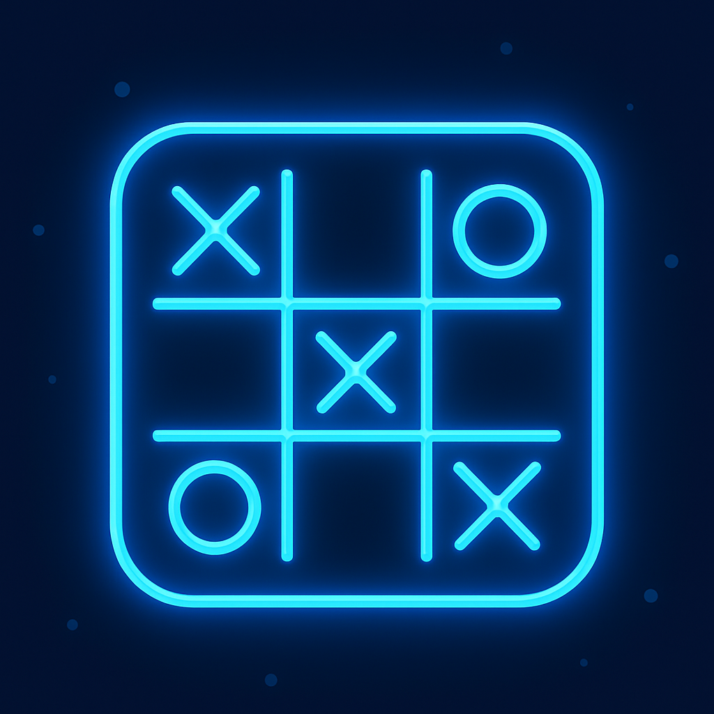
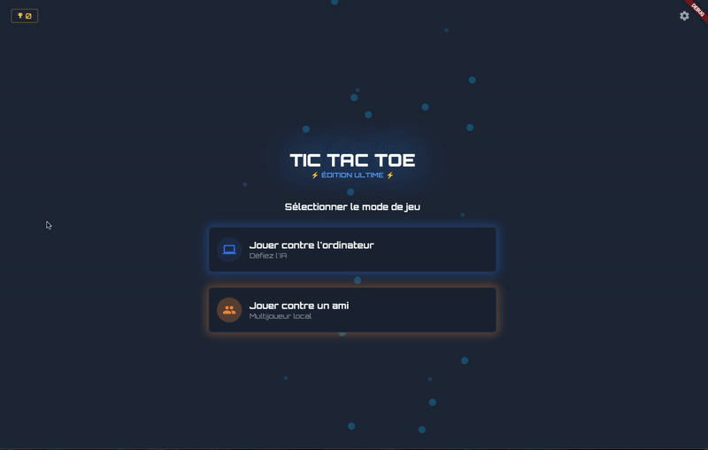
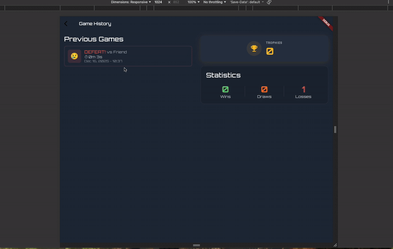

# Tic Tac Toe App 🎮

  

Une application de morpion moderne et interactive développée avec Flutter.

## ✨ Fonctionnalités

### 🎯 Modes de jeu
- **Joueur vs Joueur** : Jouer avec un ami en local sur le même appareil
- **Joueur vs IA** : Défier l'ordinateur avec un algorithme intelligent

### 🎨 Interface utilisateur
- Design moderne avec des animations fluides
- Animations Lottie pour une expérience visuelle immersive
- Thème custom
- Interface responsive qui s'adapte à tous les écrans

### 📊 Statistiques et historique
- Consulter l'historique complet de toutes vos parties
- Gagner des trophées à chaque victoire
- Accéder à vos statistiques personnalisées (victoires, défaites, matchs nuls)
- Visualiser le temps de jeu pour chaque partie

### 🌍 Internationalisation
- Disponible en plusieurs langues (français/anglais)
- Changement de langue en temps réel

### ⚙️ Fonctionnalités techniques
- Stockage local des données avec [Sembast](https://pub.dev/packages/sembast) (NoSQL) et [SharedPreferences](https://pub.dev/packages/shared_preferences)
- Clean architecture avec séparation des responsabilités
- State management avec [Riverpod](https://pub.dev/packages/flutter_riverpod)
- Navigation fluide avec [AutoRoute](https://pub.dev/packages/auto_route)
- Reporting des erreurs avec [Sentry](https://pub.dev/packages/sentry_flutter) pour un suivi en temps réel
- Timer intégré pour chronométrer vos parties

##  Dépendances principales

- **flutter_riverpod** : Gestion d'état réactive
- **auto_route** : Navigation déclarative
- **lottie** : Animations vectorielles
- **shared_preferences** : Stockage de données simples
- **sembast** & **sembast_web** : Base de données NoSQL pour le stockage local
- **intl** : Internationalisation et localisation
- **sentry_flutter** : Reporting d'erreurs et monitoring

## 📱 Plateformes supportées

- ✅ iOS
- ✅ Android
- ✅ Web

## 🧪 Tests

Le projet inclut des tests unitaires pour les composants critiques de l'application :
- Tests du provider de jeu ([game_state_provider_test.dart](test/features/game/presentation/providers/game_state_provider_test.dart))
- Tests du repository ([game_repository_test.dart](test/features/game/data/repositories/game_repository_test.dart))

Les tests de widgets n'ont pas pu être réalisés par manque de temps, mais constituent une évolution possible pour garantir la qualité de l'interface utilisateur.

## 🎬 Démonstrations

### Partie en local
Possibilité de jouer également avec un ami en local, avec une animation de victoire dans les couleurs du gagnant (couleurs différentes de la victoire contre IA)

### Victoire
Des animations sur les widgets + lottie sont présentes pour la victoire, en local ou contre l'IA

### Historique des parties
Possibilité de consulter l'ensemble des parties passées, statistiques de victoires, matchs nul, défaites, avec détail de chaque partie

### Changement de langue
L'application est disponible en plusieurs langues avec un changement instantané. Il est possible de passer du français à l'anglais sans redémarrer l'application.

### Version web
L'application fonctionne parfaitement sur les navigateurs web avec toutes les fonctionnalités et un design responsive.

### Mise en page responsive
Découvrir comment l'application s'adapte automatiquement aux différentes tailles d'écran et orientations pour offrir la meilleure expérience possible sur n'importe quel appareil.

## 💡 Évolutions possibles

Cette application pourrait être enrichie avec les fonctionnalités suivantes pour offrir une expérience gamifiée encore plus complète :

### 🔐 Système d'authentification
- Social Auth (Google, Apple, Facebook)
- Gestion de votre profil utilisateur
- Synchronisation de vos données entre tous vos appareils

### 🌐 Mode multijoueur en ligne
- Affronter d'autres joueurs en temps réel
- Système de matchmaking pour trouver des adversaires
- Chat intégré pendant vos parties
- Liste d'amis et système d'invitations

### 🏆 Classement mondial
- Leaderboard global
- Classements par région ou pays
- Palmarès hebdomadaires et mensuels
- Badges et réalisations à débloquer

### 🎫 Système de tickets quotidiens
- Tickets gratuits renouvelés chaque jour
- Achats in-app pour débloquer des tickets supplémentaires
- Packs de tickets avec bonus
- Offres spéciales et promotions

### 🎨 Personnalisation
- Créer votre avatar personnalisé
- Choisir parmi différents thèmes de plateau
- Personnaliser vos symboles (X et O)
- Ajout d'effets sonores et de musiques d'ambiance

### 🔔 Notifications push
- Recevoir des rappels pour revenir jouer
- Être notifié des défis quotidiens
- Alertes pour vos parties en attente
- Notifications de vos nouveaux records personnels
- Messages de réengagement personnalisés

### 📈 Analyse et engagement
- Relever des défis quotidiens et hebdomadaires
- Participer aux événements saisonniers et tournois

### 💰 Monétisation
- Achats in-app (tickets, thèmes, avatars)
- Publicités récompensées pour gagner des tickets
- Abonnement avec avantages exclusifs

Ces fonctionnalités transformeraient l'application en un jeu complet avec une forte rétention utilisateur, une valorisation de chaque partie et l'ajout d'un modèle économique.

## 📄 Licence
Ce projet est développé à des fins éducatives et de démonstration.
